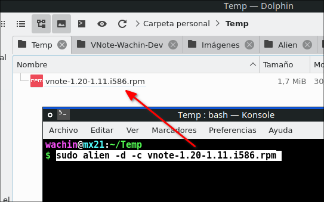
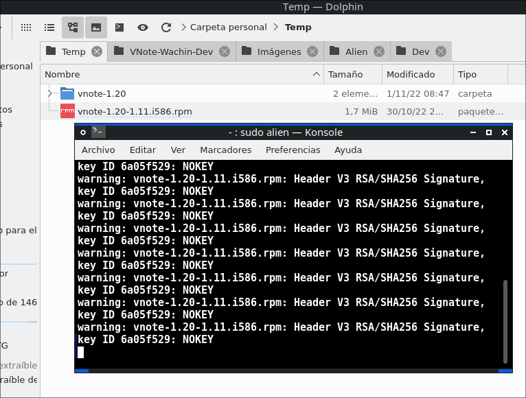
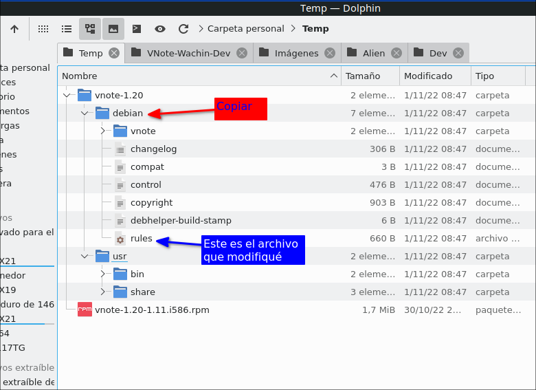

# VNote-debian-rules
Las reglas de debian para compilar VNote al estilo Alien


# Alien para obtener el archivo rules
Si se pregunta cómo se esto, bueno pues un día estaba convirtiendo un rpm de VNote a deb y allí empezó todo. Había buscado la palabra:
 
vnote
 
en:

http://rpm.pbone.net/

y encontré:

http://rpm.pbone.net/info_idpl_54111599_distro_opensusetumbleweed_com_vnote-1.20-1.11.i586.rpm.html
    
y al momento de poner el comando de conversión:

```
sudo alien -d -c vnote-1.20-1.11.i586.rpm
```

en la siguiente imagen les explico:

 

ejecutando la conversión:

 

 Alien crea la carpeta debian:
 


copiar la carpeta debian y dentro está el archivo rules que Alien ha creado, ese es el archivo que modifiqué, puede comparar los cambios con por ejemplo Meld. Lo que hice yo fue modificar el comando que buscaba la carpeta usr pues el de Alien buscaba todos los archivos alrededor y en nuestro proyecto no podemos hacer eso pues alrededor de la carpeta usr tenemos las demás carpetas de vnote. 

